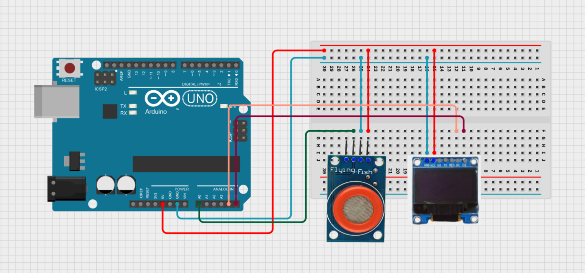
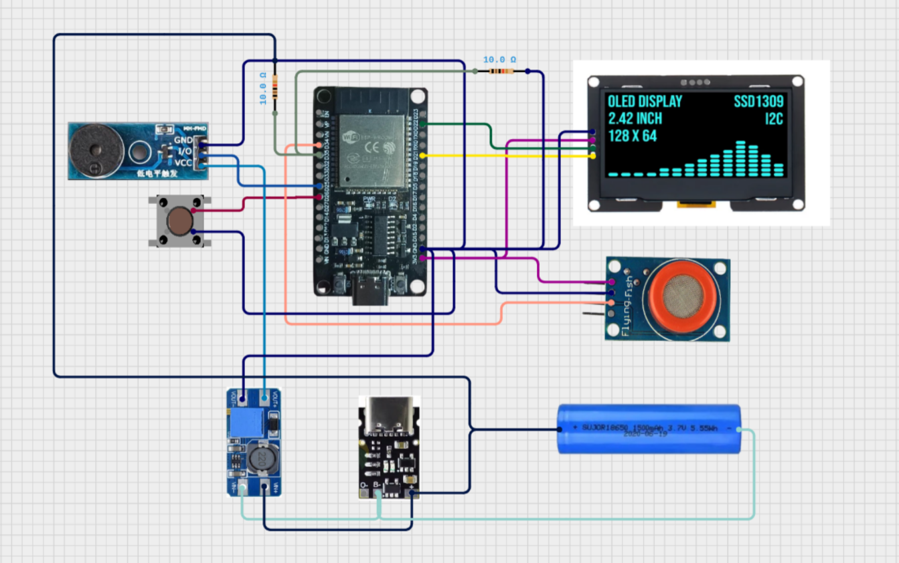
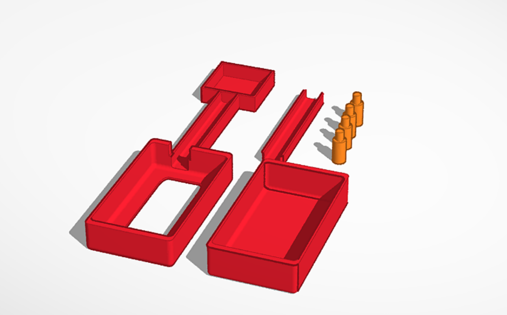
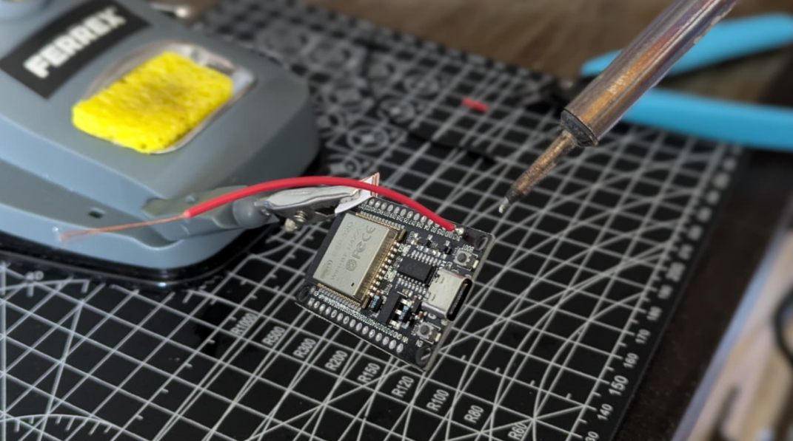
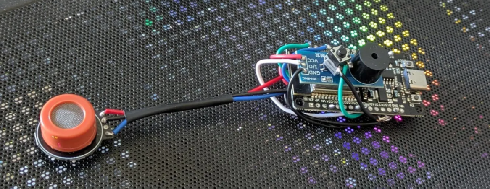
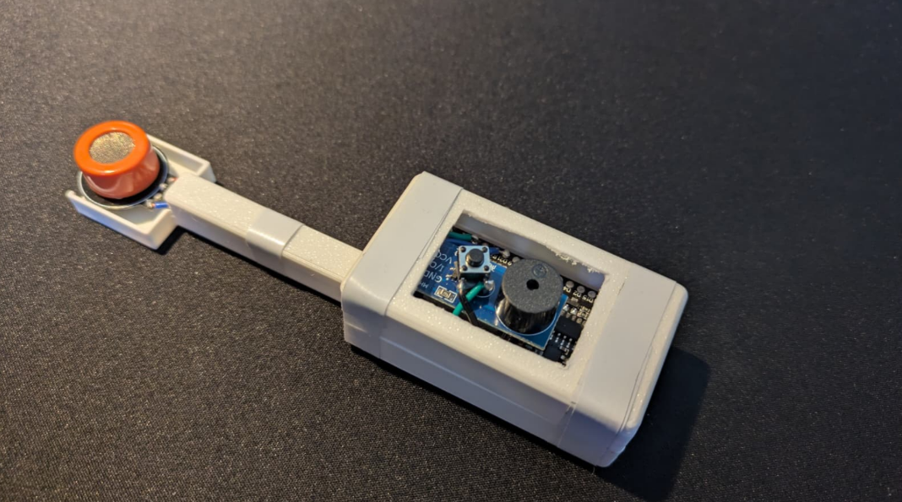
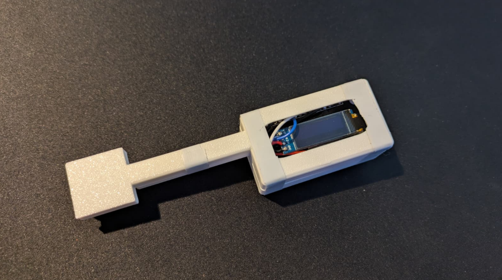

# ESP32 Alcohol Detector

This readme covers the design and development process of a portable electronic
breathalyzer. The project was carried out in two distinct
phases: an initial functional version on the Arduino UNO platform, and an
improved final version on the ESP32 module, incorporating button-based
controls and a more complete user interface.

A breathalyzer is a device that estimates the concentration of ethyl alcohol in
a person's exhaled breath. This measurement correlates with blood alcohol
content and breath alcohol content, parameters that are regulated for driving
vehicles.

The main objective of the project was to implement a real-time measurement
and display system on the Arduino UNO microcontroller as a proof of concept,
and then migrate and improve the system on the ESP32 platform, including
power management via deep sleep, button control with multiple gestures, and
an improved OLED display.

The complete development process is documented below, including design
decisions and lessons learned.

## Operating Principle of the MQ-3 Sensor

The MQ3 is a gas sensor from the MQ (Metal Oxide Semiconductor) family,
whose sensing element is a tin dioxide (SnO₂) body of variable electrical
resistance deposited on an alumina substrate, internally heated by a heating
resistor (heater) that operates at a working temperature of approximately
300 °C.

Its operation is based on the variation of the semiconductor's conductivity when
molecules of a reducing gas (in this case ethanol) are adsorbed on its surface —
either in clean air (atmospheric oxygen is adsorbed on the SnO₂ surface,
capturing electrons and increasing the material's electrical resistance, i.e. high
Rs), or in the presence of ethanol (alcohol molecules react with the adsorbed
oxygen, releasing electrons back into the material and significantly reducing
its resistance, i.e. low Rs).

The MQ3 sensor has two outputs:

- **AOUT (analog output):** voltage proportional to the conductivity of the
  sensing material; this is the output used in this project.
- **DOUT (digital output):** comparator with a threshold adjustable via a
  potentiometer.

The warm-up time recommended by the manufacturer is 20 seconds at each
power-on, to stabilize the operating temperature and obtain reproducible
readings. For a complete initial calibration in a production environment, a
warm-up period of 24–48 hours is recommended; however, for this
application, 20 seconds produces sufficiently stable results.

## Alcohol Concentration Calculation

The relationship between the sensor's resistance and the gas concentration
follows a logarithmic curve as described in the MQ3 datasheet. However, this
project adopted a more practical approach based on relative calibration:

```
ratio = DC reading / baseline
mg/L = 0.4 × (ratio − 1.0)
```

where **baseline** is the average of 100 readings taken in clean air during
calibration.

This approach was chosen because it offers several advantages over the
datasheet's logarithmic curve, the most important being that it does not
require knowing the absolute value of R0 or the module's exact load
resistance RL.

In addition, calibrating in clean air automatically absorbs variations in
temperature, humidity, and sensor aging.

## Legal Blood Alcohol Regulations in Spain

The breath alcohol thresholds currently in force in Spain, set by Royal Decree
1428/2003 (General Traffic Regulations), are as follows:

| Group | Limit (mg/L breath) | Blood equivalent |
|---|---|---|
| General drivers | 0.25 mg/L | 0.5 g/L |
| Novice drivers (< 2 years) and professional drivers | 0.15 mg/L | 0.3 g/L |
| Serious offense | 0.50 mg/L | 1.0 g/L |
| Criminal offense | ≥ 0.60 mg/L | ≥ 1.2 g/L |

The thresholds implemented in the device (0.10 / 0.25 / 0.50 mg/L) were set
slightly conservatively to account for the uncertainty of the MQ3 sensor.

## Arduino Prototyping

### Components

| Component | Name |
|---|---|
| Microcontroller | Arduino UNO (ATmega328P) |
| Alcohol sensor | MQ3 |
| Display | OLED SSD1306 128×64 I2C |
| Power supply | USB (5V) |

### Wiring diagram

| Component | Component pin | Arduino pin |
|---|---|---|
| MQ3 | VCC | 5V |
| MQ3 | GND | GND |
| MQ3 | AOUT | A0 |
| OLED | VCC | 3.3V |
| OLED | GND | GND |
| OLED | SDA | A4 (SDA) |
| OLED | SCL | A5 (SCL) |

The MQ3 is powered at 5V (from the Arduino's USB line) to ensure the
internal filament heats up correctly.

The sensor's AOUT output is connected to the analog pin A0, whose ADC has
10-bit resolution (0–1023) with a 5V reference voltage.



### Code

**1. Initial calibration**

On power-up, the program displays a message on the OLED screen for 2
seconds and then takes 100 analog readings from the sensor, 50 ms apart
(5 seconds total). The arithmetic mean of these readings is stored as
`baseline`, which represents the signal level in clean air and serves as the
reference for all subsequent measurements.

```cpp
long sum = 0;
for (int i = 0; i < 100; i++) {
  sum += analogRead(mq3Pin);
  delay(50);
}
baseline = sum / 100.0;
R0 = baseline;
```

**2. Measurement loop**

On each iteration, the program reads the sensor's analog value, calculates the
ratio relative to the calibrated baseline, and applies the linear formula to
obtain the concentration in mg/L:

```cpp
int raw = analogRead(mq3Pin);
float ratio = (float)raw / R0;
float mgL = calibrationFactor * (ratio - 1.0);
if (mgL < 0) mgL = 0;
```

Based on the `mgL` value, the result is classified into one of four states and
the OLED screen is updated every second.

### Prototype results

Three techniques were used to test the effectiveness of the breathalyzer.
First, using an isopropyl alcohol atomizer, the recorded alcohol peaks were
correctly observed. Then, using an atomizer with a mixture of alcohol and
water, a lower measured concentration was validated. Finally, dry tests were
performed by blowing directly onto the sensor intake, which allowed a
baseline to be established.

The Arduino version worked as expected, and it was possible to see how the
MQ3 sensor with baseline calibration produced consistent and repeatable
readings, capable of distinguishing between a sober state and different
degrees of alcohol exposure.

However, several limitations were identified. The first and most relevant one
during testing was the need for recalibration during use, since if the sensor
became impregnated with alcohol during the ethanol spray test, there was no
way to recalibrate without restarting.

In addition, the 10-bit ADC provided lower resolution than the ESP32 can
theoretically offer (12 bits), which motivated its later use.

Finally, ghost pixels frequently appeared on the OLED screen, since the
continuous screen refresh using `clearDisplay()` produced visual artifacts.

## Final Version with ESP32

### Motivation for the platform change

The migration from Arduino UNO to ESP32 addresses several needs
identified in the prototype. The main reason was that the ESP32 has a 12-bit
ADC (0–4095), doubling the measurement resolution compared to the
Arduino's 10-bit ADC (0–1023).

It also includes native support for deep sleep with GPIO wake-up, enabling a
true system shutdown with virtually zero power consumption (~10 μA), while
keeping only the button-detection circuit active.

The ESP32's higher computational performance (240 MHz dual-core vs.
16 MHz) allows intensive ADC oversampling to be implemented without any
noticeable impact on the user experience.

Finally, the ESP32's form factor and library ecosystem are compatible with the
existing Arduino code and more intuitive when scaling the system with
additional components, which facilitated the migration.

### Components

Initially, the breathalyzer proposal aimed to implement its own power supply
that would eliminate the ESP32's dependence on always being connected to
an external power source.

For this reason, the initially designed power system was intended to follow
this architecture:

```
18650 Battery (3.7V)
│
├──► TP4056 ◄── USB-C (external charging)
│               │
│             OUT+ ─────────────────────────┐
│
│
├──────────────► ESP32 VIN                             MT DC-DC
                                                          boost
│                                                         (3.7-4.2V)
│
│
                                                         VOUT+ (5V)
│
│
└──────────────────────────── Buzzer VCC
```

Since the ESP32 accepts input voltages between 3.0V and 3.6V on the 3V3
pin, and between 4.5V and 9V on the VIN pin: with the 18650 battery
connected directly to VIN (range 3.7–4.2V), the ESP32's internal regulator
would guarantee a stable 3.3V, so a DC-DC converter would only be needed
to power 5V peripherals (such as the buzzer at full power).

However, an MT boost DC-DC converter would be necessary because the
high-level-trigger buzzer module requires 5V on its VCC pin to activate
correctly; at 3.7V the activation signal is insufficient. The DC-DC module's
potentiometer would be adjusted with a multimeter to 5.0V before connecting
the buzzer.

Finally, for reading the battery level, a resistive voltage divider (R1 = R2 =
100 kΩ) is implemented between the battery's positive terminal and GND,
with the midpoint connected to pin GPIO35 (input-only pin), so that the ESP32
reads half of the actual battery voltage and scales it to the 3.0–4.2V range
(it reads half the actual battery voltage and multiplies it by 2 internally) to
calculate the charge percentage. GPIO35 is ideal because, like GPIO34, it is
input-only and has no internal pull-up that could interfere.

Unfortunately, this implementation was not possible in the end due to a
puncture in the Li-ion battery during shipping, and it could neither be salvaged
nor replaced in time due to long shipping delays. That said, the power supply
system is still conceptually and theoretically documented in this report, and
its connection diagram and corresponding code implementation are therefore
still included.

| Component | Name | Function |
|---|---|---|
| Microcontroller | ESP32 Dev Module | Central processing unit |
| Alcohol sensor | MQ3 | Ethanol detection in air |
| Display | OLED SSD1306 128×64 I2C | Results display |
| Buzzer | High-level trigger module | Calibration audio signal |
| Button | Standard tactile button | Power on/off/calibration control |
| Battery | HJ 18650 3.7V 1500mAh | Standalone power supply |
| Battery charger | TP4056 USB-C 5V 1A | Li-ion battery charging |
| DC-DC converter | MT boost 2A (2V–5V) | Step-up to 5V for the buzzer |

### Full wiring diagram

| Component | Pin | ESP32 pin / Destination |
|---|---|---|
| MQ3 | VCC | 3V3 |
| MQ3 | GND | Common GND |
| MQ3 | AOUT | GPIO34 (ADC1) |
| OLED | VCC | 3V3 |
| OLED | GND | Common GND |
| OLED | SDA | GPIO21 |
| OLED | SCL | GPIO22 |
| Buzzer | VCC | MT DC-DC VOUT+ (5V) |
| Buzzer | GND | Common GND |
| Buzzer | I/O | GPIO25 |
| Button | Pin 1 | GPIO26 |
| Button | Pin 2 | Common GND |
| Battery | B+ | TP4056 B+ |
| Battery | B− | TP4056 B− / Common GND |
| TP4056 | OUT+ | ESP32 VIN + MT DC-DC VIN+ |
| TP4056 | OUT− | Common GND |
| MT DC-DC | VIN+ | TP4056 OUT+ |
| MT DC-DC | VIN− | Common GND |
| MT DC-DC | VOUT+ | Buzzer VCC |
| MT DC-DC | VOUT− | Common GND |
| Battery voltage divider | BAT+ → R1 (100 kΩ) → GPIO35 → R2 (100 kΩ) → GND | GPIO35 (input only) |

It is worth noting that the button does not require an external pull-up
resistor, because the ESP32's internal pull-up is enabled via `INPUT_PULLUP`
in the code.

The common GND connects all modules (ESP32, MQ3, OLED, buzzer,
TP4056, DC-DC converter, and battery negative terminal).

The pull-up resistor simply keeps the pin at a high level when the button is
open, so the pin does not float and produce random readings. When the
button is pressed, the pin drops to GND and the ESP32 detects it as LOW.
The current flowing is therefore on the order of ~70 μA — enough for the
logic pin, but completely insufficient to power any component.

### Wiring diagram



For the full version, the layout is as follows:

As the final implementation, given the limitations encountered, the resulting
setup is:

### Improvements implemented

To eliminate ghost pixels on the OLED, `clearDisplay()` was replaced with
`fillRect(0,0,128,64,BLACK)`, which explicitly sets all pixels to black before
composing the new frame. In addition, the refresh is now conditional — the
screen is only redrawn when the measured value changes by more than
0.005 mg/L or the text status changes — eliminating flicker and reducing the
load on the I2C bus.

Since the ESP32's ADC exhibits a known non-linearity (typical error of ~6%)
due to its SAR (Successive Approximation Register) architecture, ×64
oversampling has been applied, in which 64 consecutive readings are summed
and divided by 64, reducing quantization noise by approximately 3 additional
effective bits.

A state machine has been implemented with three states: `ST_CALENTANDO`
(warming up), `ST_CALIBRANDO` (calibrating), and `ST_MIDIENDO`
(measuring). True shutdown is implemented via `esp_deep_sleep_start()`, with
wake-up configured on a low level on the button pin (ext0). In deep sleep, the
ESP32's power consumption drops to ~10 μA, which would extend battery
life.

Additionally, three features have been added to improve the human-computer
interaction.

First, a basic system was programmed to detect certain button gestures
without blocking delays, using only `millis()` timestamps:

| Gesture | Detection | Action |
|---|---|---|
| 1 short press | Falling edge + duration < 2s, only 1 click within 400ms | Wake-up / power on |
| 2 short presses | 2 clicks within a 400ms window | Sensor recalibration |
| Hold ≥ 2s | Pin LOW for ≥ 2000ms | Power off (deep sleep) |

Second, as a small addition, the battery level is now displayed on startup,
showing the battery charge percentage for 2 seconds along with a graphical
representation. There is also a visual cue for recalibration: when
recalibration is triggered with a double tap, the system first shows a 3-second
warning telling the user to move the sensor away from any alcohol source,
followed by a progress bar with a counter.

Finally, it was decided to create an enclosure to house all the components
and make the device easier to use. It was first designed in Tinkercad, a 3D
modeling tool. It was then prepared with a conventional slicer and finally
3D-printed, after which the plastic was finished and the components were
installed.



### Code

The program is organized into the following functional sections:

- Definition of pins and global constants.
- ADC functions: `leerADC()` (readADC) with oversampling and non-linearity
  correction.
- MQ3 functions: `calcularMgL()` (calculateMgL) using the calibrated linear
  formula.
- Battery functions: `leerBateriaPct()` (readBatteryPct) via the resistive
  divider.
- OLED functions: individual screens for each system state.
- `calibrar()` (calibrate) function: baseline capture with a visual progress
  indicator.
- `apagar()` (shutdown) function: deep sleep with wake-up via the button.
- `gestionarBoton()` (handleButton) function: gesture-detection state
  machine without delays.
- `setup()`: boot sequence (boot → battery → warm-up → calibration).
- `loop()`: measurement, classification, and OLED update cycle.

### Key code snippets

**Calibration:**

```cpp
oledCalibrando();
beep(1, 80);
delay(3000);
// 100 samples × 50ms = 5s with progress bar
long suma = 0;
for (int i = 0; i < 100; i++) {
  suma += analogRead(PIN_MQ3);
  if (i % 20 == 0) {
    oledCalibrandoProgreso(5 * (i / 20));
  }
  delay(50);
}
baseline = (float)(suma / 100);
```

**Button gesture detection:**

```cpp
void gestionarBoton() {
  bool pulsado = (digitalRead(PIN_BOTON) == LOW);
  uint32_t ahora = millis();

  if (pulsado && !botonEstaba) {          // falling edge
    tBotonBajo = ahora;
    botonEstaba = true;
  }
  if (pulsado && (ahora - tBotonBajo) >= LONG_MS) apagar();
  if (!pulsado && botonEstaba) {          // rising edge
    botonEstaba = false;
    if ((ahora - tBotonBajo) >= DB_MS) {
      clickCount++;
      tUltimoClick = ahora;
    }
  }
  if (clickCount >= 2 && (ahora - tUltimoClick) > DCLICK_MS) calibrar();
}
```

### Implementation process

To install all the components on the ESP32, the entire circuit was soldered.
To do this, and to make soldering easier, all Dupont connectors were removed
from the components, especially from the ESP32, buzzer, and MQ3 sensor.



All terminals were then carefully tinned. During this process, the circuit had
to be redone up to 3 times due to the choice of materials.

Initially, solid aluminum wires were used. Although very easy to work with,
they presented certain difficulties in fitting all the components in a minimalist
way, as they were too rigid.

As a result, stranded copper wiring was chosen instead. At first it was
soldered on only one side — that is, solder was applied to the top face of the
board at each wire terminal in order to save both time and space between the
different connections — but this ultimately proved insufficient, since the small
amount of solder could not withstand pulling on the wire and would come
loose from the socket.

Due to these failures, it was decided to continue working with stranded
wires, this time without skimping on either flux paste or solder, finally
achieving a robust and minimalist circuit.



Finally, all that remained was to install the circuit in the enclosure.





## Bibliography

- Hanwei Electronics Co., Ltd. *MQ3 Semiconductor Sensor for Alcohol
  Datasheet*. Rev. 1.4, 2015.
- SolomonSystech Ltd. *SSD1306 Advance Information – 128×64 Dot Matrix
  OLED/PLED Segment/Common Driver with Controller*. Rev. 1.1, 2008.
- Espressif Systems. *ESP32 Technical Reference Manual*. v5.3, 2024. [Online]
  https://www.espressif.com/sites/default/files/documentation/esp32_technical_reference_manual_en.pdf
- Espressif Systems. *ESP32 Errata – ADC Non-Linearity*. EN-7002, 2020.
- Adafruit Industries. *Adafruit SSD1306 Library Documentation*. [Online]
  https://github.com/adafruit/Adafruit_SSD1306
- Arduino Project. *Arduino Reference – analogRead()*. [Online]
  https://www.arduino.cc/reference/en/language/functions/analog-io/analogread/
- Royal Decree 1428/2003, of November 21, approving the General Traffic
  Regulations. *BOE* no. 306, December 23, 2003.
- DigiKey Electronics. *RC Low-Pass and High-Pass Filter Calculator*. [Online]
  https://www.digikey.es/es/resources/conversion-calculators/conversion-calculator-low-pass-and-high-pass-filter
- Arduino - MQ3 alcohol sensor: Arduino Tutorial. Arduino Getting Started.
  (2026, April 23). https://arduinogetstarted.com/tutorials/arduino-mq3-alcohol-sensor
- Pereira, R., Karthikeyan, Nahian, Md., Bogdan, Omkar, Imran, Hayes, E.,
  Microcontrollers Lab, Lochy, Srivatchan, Sett, D. D., Tom, Lanavape, Model,
  F. R., Parts, C. M., jet, F. ares 3D, & Milan. (2025, December 2). ESP32
  pinout - how to use GPIO pins? Pin mapping of ESP32. Microcontrollers Lab.
  https://microcontrollerslab.com/esp32-pinout-use-gpio-pins/
- Pelayo, R. (2025, September 22). LCD Bitmap Converter Online.
  Microcontroller Tutorials. https://www.teachmemicro.com/lcd-bitmap-converter-online/
- How to wire alcohol gas sensor - MQ-3 to Arduino Uno. circuito.io. (n.d.).
  https://www.circuito.io/app?components=512%2C11021%2C398783
- Cirkit Designer Ide. Cirkit Designer IDE. (n.d.). https://app.cirkitdesigner.com/